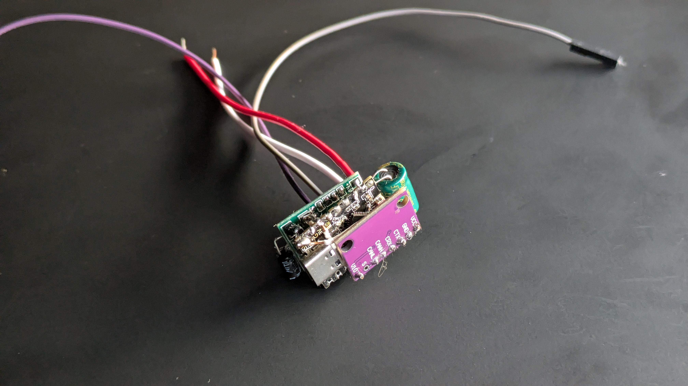

# Volvo V70 Custom CAN Bus Control Unit
This is my first embedded systems project. The goal here is to build a custom CAN Bus control unit that fits perfectly behind one of the blank switch covers in my Volvo V70.
It's an open-ended learning playground where I'm figuring out hardware, software, and automotive networking from scratch, since university courses rarely cover embedded systems in depth.

## The Backstory & Idea

I am very passionate about the mechanical engineering of cars, more so their engines. That is one of the reasons why I wanted to modify my car, but not in a sporty way.
A boxy Volvo wagon will never be a sports car, so I wanted it to look and function like a utility vehicle. The first modification is auxiliary work lights (declared as work lights to pass TÜV inspection).
For this, I obviously needed a switch or button inside the cabin to turn the lights on and off.

**The Original Plan:** At first, I wanted to keep it simple: just a basic physical switch and a relay, that send power over a relais to the lights.

**The Problem:** To pull that off, I would have had to run new wires through the car, which meant drilling a hole into the plastic housing of an existing factory control unit. I chose against that to preserve the OEM part.

**The New Plan:** Instead of drilling into the existing control unit, I decided to build a secondary control unit. It will sit inside the existing control unit, tapping directly into its power supply and CAN bus lines. That way I can preserve the clean OEM look of the center stack and achieve a seamless integration.

---

## Learning Goals

Since this is my gateway into the world of embedded engineering, I'm using it to learn a ton of different concepts:
* **Digital Communication & Protocols:** Deep-diving into how the CAN Bus protocol actually works under the hood.
* **Electronics & PCB Design:** Going from breadboarding to designing a custom schematic, picking ICs, and routing a circuit board.
* **Hardware Design & EMC:** Figuring out electromagnetic compatibility so the car's signals don't mess with my board (and vice versa).
* **Embedded Software Architecture:** Implementing FreeRTOS to handle multitasking on the microcontroller.
* **3D Design:** Designing custom enclosures, connectors, and switches specifically with 3D printing in mind.

---

## Current Status & Hardware

Right now, the project is in the early electronic prototyping stage. For this I soldered up a prototype, in order to sniff the car's CAN Bus.
Sadly there is not photo of the first prototype, which uzilized a different CAN Transceiver (SN65HVD230) and a slightly different layout. I ended up throwing it out in favor of size and thermal advantages.
Additionally the first prototype was not receiving any message frames from the car's CAN Bus. I switched to a newer, higher-quality CAN Transceiver (TJA1042), though unfortunately, that hasn't fully resolved the issue yet.

The main goal for now is to successfully analyze the CAN Bus for existing IDs. This will help prevent choosing an already assigned ID for my new control unit and allow me to log messages from various control units for potential future use.

The current control unit consist of a ESP32-C3 as the brain, a TJA1042 CAN Transciever and a MP1584EN buck driver. A silicone dome button will actuate the circuit, a P6KE7.5A TVS diode protects the buck driver and a 40A automotive relais will deliver power to the lights.

---

### Prototypes & Shells

<!-- TODO: Add photos -->
**Electronic Prototype 2:**
Switched transceiver board and optimized layout

**Switch Cover Prototype 1:**
Initial 3D-printed prototype designed to house a simple mechanical switch
<!--  -->

**Switch Cover Prototype 2:**
Updated version with two additional holes for wire exits (didn't fit perfectly, which ultimately triggered the switch to a fully digital architecture).
<!--  -->

---

## Codebase

Since I'm focusing heavily on the hardware right now, the software is super barebones. Currently, it only consists of basic test clients:
* **Sender Client:** A tiny script/program that pumps out dummy CAN messages for debugging.
* **Receiver Client:** A basic sniffer that listens to the bus and prints out incoming messages so I can verify everything is wired up correctly.

### How to use the Test Clients
1. Flash the `sender` code to your test MCU.
2. Flash the `receiver` code to a second MCU.
3. Open your serial monitor to see the test messages flowing!

---

## Roadmap / What's Next?

- [ ] Debug why message frames are not going through. (Double-check CAN Transceiver)
- [ ] Reverse engineer/find the specific CAN IDs for the Volvo P3 platform's control units
- [ ] Design a new switch cover with a fully integrated, sleek button
- [ ] Build the electronic prototype for the actual actuator control unit (the relay side)
